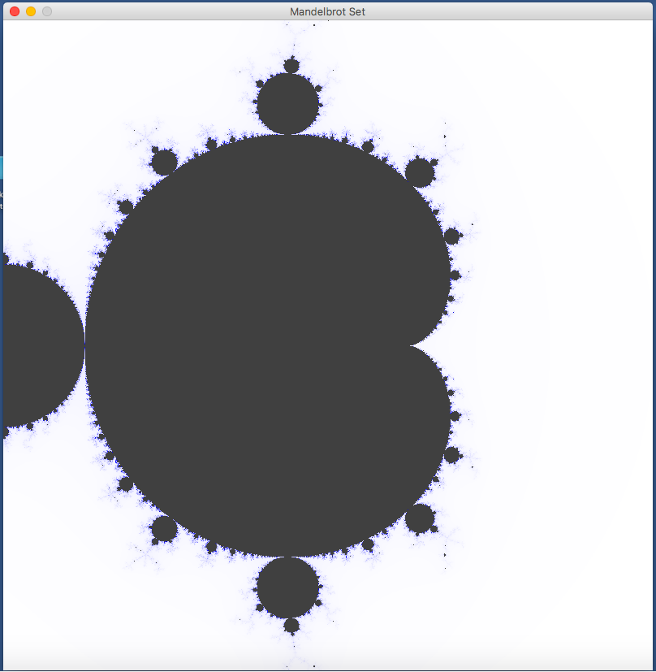
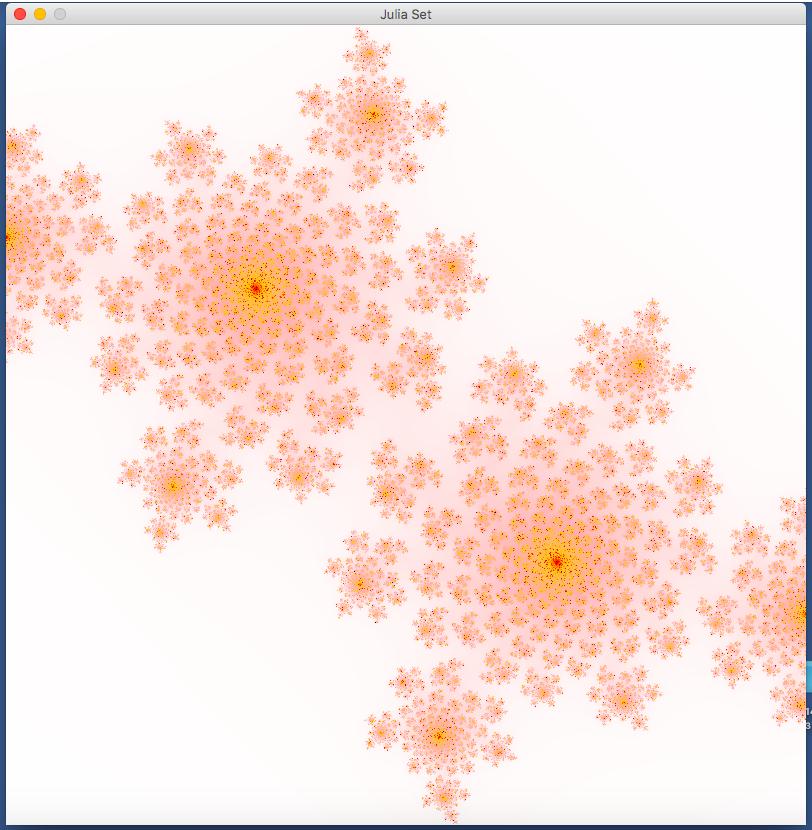

# Fracrals

## Introduction: 
You are required to design and implement a software that would plot two of the most
popular fractals: Mandelbrot set and Julia set.
Fractals are infinity many, self-similar shapes formed by some simple mathematical computations. The
computation varies from fractal set to set but are generally based on complex numbers.

## The Mandelbrot set: 
In mathematics Mandelbrot set is defined as the set of complex numbers C such
that: Z n+1 = (Zn)^2 + C , starting with Z0 = 0 remains bounded when n reach infinity. In other words 
if for some C the above equation remains bounded for after many iterations then that C is in the Mandelbrot
set. There is a mathematical proof which shows that if ABS(Zn) > 2 the above equation will diverge
hence C is not in the Mandelbrot set. Some complex numbers will be in the Mandelbrot set and some
are not.
- To genatare Mandelbrot set image `Mandelbrot -Rx1 Rx2 -Iy1 Iy2 NumberOfIteration` 

Rx1 Lower Boundary of x range 

Rx2 Upper Boundary of x range 

Iy1 Lower Boundary of y range 

Iy2 Upper Boundary of y range Of Canvas 

## The Julia set: 
The Julia set is similar to the Mandelbrot set in that it uses the same equation Zn+1 =(Zn)^2 + C 
but Z0 is the point in the complex plane corresponding to the pixel and C is a constant. The rest
of the computation is the same; including the way you map a point in the canvas to that in the complex
plane.
- To geanrate the Julia Set image `Julia -RealPartOfZ  ImaginaryPartOfZ  NumberofIteration `

 -1 < Real(Z) < 1 

 -1 <  Img(Z) < 1
 
 ## Output
 
   
  
